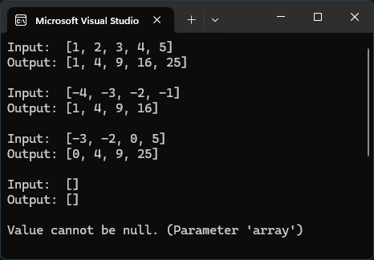

```cs
Demo([1, 2, 3, 4, 5]); //all positive input
Demo([-4, -3, -2, -1]); //all negative input
Demo([-3, -2, 0, 5]); // mix of negative, zero, and positive
Demo([]); // empty array

// ArgumentNullException should be thrown for null input
try { Demo(null); } catch (ArgumentNullException e) { Console.WriteLine(e.Message); }
```


